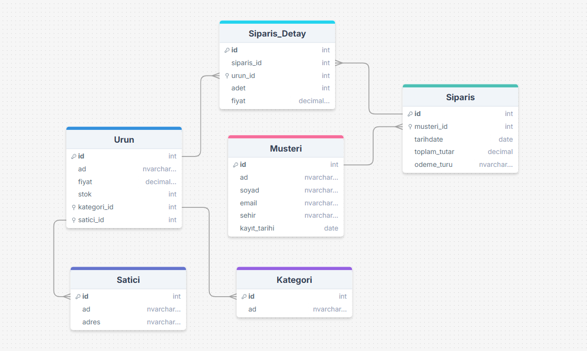

# DigitalMarketDB  (E-Ticaret Veri Tabanı)

## İçindekiler  
1. [Projenin Amacı](#projenin-amacı)  
2. [Senaryo](#senaryo)  
3. [Adım Adım Görevler](#adım-adım-görevler)  
   - [A. Veri Tabanı Tasarımı](#a-veri-tabanı-tasarımı)  
   - [B. Veri Ekleme ve Güncelleme](#b-veri-ekleme-ve-güncelleme)  
   - [C. Veri Sorgulama ve Raporlama](#c-veri-sorgulama-ve-raporlama)  
   - [D. İleri Seviye Görevler (Opsiyonel)](#d-ileri-seviye-görevler-opsiyonel)  
4. [Özellikler](#özellikler)  
5. [ER Diyagramı](#er-diyagramı)  
6. [Tasarım Süreci](#tasarım-süreci)  
7. [Karşılaşılan Sorunlar ve Çözümler](#karşılaşılan-sorunlar-ve-çözümler)  
8. [Kullanım](#kullanım)  

---

## Projenin Amacı   
Bu proje, **Digital Market** adında bir online alışveriş platformunun veritabanını tasarlamak ve yönetmek amacıyla gerçekleştirilmiştir. Platformda müşteri, satıcı , ürün, sipariş , kategori, ödeme ve satıcı gibi veriler yer almakta ve bunların doğru şekilde yönetilmesi gerekmektedir.
Bu kapsamda proje, aşağıdaki kazanımları hedeflemektedir:  
- Veritabanını tasarlamak ve tablolar arasındaki ilişkileri kurmak,  
- Veri ekleme, güncelleme ve silme işlemlerini uygulamak,  
- Raporlama ve analiz sorguları çalıştırmak,  
- Karmaşık SQL sorgularında pratik yaparak ustalaşmak.
- 
Kısacası, bu proje hem teorik bilgiyi pratiğe dökmeyi hem de gerçek bir senaryoya uygun veritabanı sistemi kurmayı amaçlar.


---

## Senaryo  
Bir online alışveriş platformunda **müşteri, ürün, sipariş, kategori, ödeme, satıcı** gibi veriler yönetilmek zorundadır.  
Öğrencilerden, bu sistemi **sıfırdan tasarlamaları ve SQL ile yönetmeleri** istenir.  

---

## Adım Adım Görevler  

### A. Veri Tabanı Tasarımı  
Tablolar:  
- **Musteri** (id, ad, soyad, email, sehir, kayit_tarihi)  
- **Urun** (id, ad, fiyat, stok, kategori_id, satici_id)  
- **Kategori** (id, ad)  
- **Satici** (id, ad, adres)  
- **Siparis** (id, musteri_id, tarih, toplam_tutar, odeme_turu)  
- **Siparis_Detay** (id, siparis_id, urun_id, adet, fiyat)  

İlişkiler:  
- Bir müşteri birden fazla sipariş verebilir.  
- Bir sipariş birden fazla ürün içerebilir.  
- Bir ürünün bir kategorisi vardır.  
- Bir ürün bir satıcıya aittir.  

---

### B. Veri Ekleme ve Güncelleme  
- Örnek müşteri, ürün ve sipariş verileri ekle.  
- `INSERT`, `UPDATE`, `DELETE`, `TRUNCATE` kullan.  
- Stok azaldığında güncelleme sorguları uygula.  

---

### C. Veri Sorgulama ve Raporlama  
**Temel Sorgular:**  
- En çok sipariş veren 5 müşteri.  
- En çok satılan ürünler.  
- En yüksek cirosu olan satıcılar.  

**Aggregate & Group By:**  
- Şehirlere göre müşteri sayısı.  
- Kategori bazlı toplam satışlar.  
- Aylara göre sipariş sayısı.  

**JOIN’ler:**  
- Siparişlerde müşteri bilgisi + ürün bilgisi + satıcı bilgisi.  
- Hiç satılmamış ürünler.  
- Hiç sipariş vermemiş müşteriler.  

---

### D. İleri Seviye Görevler (Opsiyonel)  
- En çok kazanç sağlayan ilk 3 kategori.  
- Ortalama sipariş tutarını geçen siparişleri bul.  
- En az bir kez elektronik ürün satın alan müşteriler.  

---

## Özellikler  
- E-ticaret sisteminin temel veritabanı yapısını içerir.  
- SQL sorguları ile veri ekleme, güncelleme ve raporlama yapılabilir.  
- Öğrencilerin hem temel hem de ileri SQL becerilerini geliştirmesine yardımcı olur.  

---

## ER Diyagramı  
Aşağıda sistemin temel ilişkilerini gösteren ER diyagramı bulunmaktadır:  

  

---

## Tasarım Süreci  
1. Öncelikle e-ticaret sistemi için gerekli tablolar belirlendi: **Müşteri, Satıcı, Ürün, Sipariş, Sipariş_Detay, Kategori**.  
2. Bu tablolar arasındaki ilişkiler (1-N, N-N) belirlendi.  
3. ER diyagramı draw.sql kullanılarak oluşturuldu.  
4. Tablolar için SQL CREATE komutları yazıldı.  
5. Daha sonra örnek veriler eklendi ve test sorguları çalıştırıldı.  

---

## Karşılaşılan Sorunlar ve Çözümler  
- **Sorun:** Tabloların ilişkilerini kurarken `Siparis` ve `Siparis_Detay` arasındaki ilişkiyi doğru kurmak zor oldu.  
  - **Çözüm:** Bir siparişin birden fazla ürün içerebileceğini göstermek için ayrı bir **Siparis_Detay** tablosu eklendi.  

- **Sorun:** Stok güncellemeleri sırasında yanlış ürünlerin güncellenmesi riski vardı.  
  - **Çözüm:** `WHERE` koşulları dikkatli yazılarak yalnızca ilgili ürünlerin güncellenmesi sağlandı.  

- **Sorun:** SQL sorgularında performans problemleri yaşandı.  
  - **Çözüm:** Sık kullanılan kolonlara **index** eklenmesiyle performans artırıldı.  

---

## Kullanım  
1. Bu projeyi klonlayın:  
   ```bash
   git clone https://github.com/gulcinyzglc/DigitalMarketDB.git
   
2.Proje klasörüne gidin:
 cd DigitalMarketDB

3.SQL Server veya uyumlu bir veritabanı aracını açın.
4.Tabloları oluşturmak için create_tables.sql dosyasını çalıştırın.
5.Örnek verileri eklemek ve bazı güncellemeleri uygulamak için insert_update.sql dosyasını çalıştırın.
6.Raporlama ve analiz yapmak için queries.sql dosyasındaki sorguları çalıştırın.
7.(Opsiyonel) er diyagramını inceleyerek tablo ilişkilerini görselleştirebilirsiniz.


